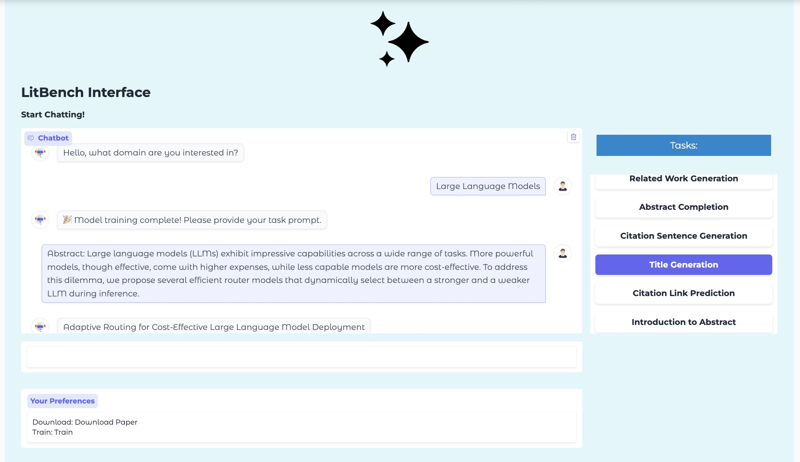

<p align="center">
  
</p>

<p align="center">
        🤗 <a href="https://huggingface.co/datasets/AliMaatouk/arXiv_Topics"> arXiv Topics Dataset</a>&nbsp| 🤗 <a href="https://huggingface.co/datasets/AliMaatouk/arXiv-Topics-Embeddings"> arXiv Topics Dataset Embeddings</a>
<br>


# LitBench: A Graph-Centric Large Language Model Benchmarking Framework For Literature Tasks

## Overview

**LitBench** is a comprehensive framework tailored to retrieve, process, and fine-tune LLMs on **academic literature-related tasks** centered around the user’s chosen domain, **however niche the domain may be**. At its core, LitBench incorporates several steps:

1. **Retrieve relevant papers**: Given any user input domain—no matter how specific or interdisciplinary—LitBench leverages the <a href="https://huggingface.co/datasets/AliMaatouk/arXiv_Topics">arXiv Topics</a> dataset to find the most relevant papers to the user's chosen domain.
2. **Download and clean papers**: The selected papers are retrieved from **arXiv** and processed to extract structured and unstructured content through an extensive cleaning pipeline.
3. **Construct a domain-specific literature graph**: Using the downloaded papers, a graph tailored to the user’s chosen domain is constructed, containing several key attributes such as:
   - **Title, Abstract, Introduction**
   - **Topics of the paper**
   - **Citation sentences**
   - **Full unstructured content (if desired)**
   - **Edges representing citation relationships**
4. **Fine-tune LLMs on graph-related tasks**: The constructed graph is used to fine-tune LLMs on **downstream literature tasks**, such as **citation prediction** and **introduction-to-abstract generation**, while also supporting applications built on these tasks, including **related work generation** and **influential paper retrieval**.

<p align="center">
  
</p>

## Installation

### Prerequisites

Ensure you have Python 3.10 installed before proceeding with the setup.

### Setup Steps

```bash
# Clone the repository
git clone <repository_url>
cd LitBench

# Create a virtual environment
python3.10 -m venv litbench

# Activate the virtual environment
source litbench/bin/activate  # On macOS/Linux
litbench\Scripts\activate  # On Windows

# Install dependencies
pip install -r requirements.txt

# Token setup for Hugging Face
huggingface-cli login
```

## Usage

Running the Citation Graph Module

```bash
cd LitBench
source litbench/bin/activate  # Activate virtual environment
python3.10 src/litbench_pipeline.py
```

## Navigating the LitBench UI

The LitBench user interface consists of two main stages: **preferences selection** and **the interactive chatbot interface**.

### **1. Setting Preferences**
Upon launching the interface, users are first directed to the preferences page, where they must specify:
- Whether to **download** new papers and construct a dataset from scratch, otherwise use a pre-defined dataset set from the config file.
- Whether to **train the model** on the retrieved/predetermined dataset or use a pre-trained model from the config file.

Once preferences are set, users are directed to the chatbot interface.

### **2. Chatbot Interface**
After setting preferences:
- If **training is selected**, users will first be prompted to specify their domain of interest before proceeding.
- If **no training is selected**, users will be immediately prompted to provide their task prompt.

Once relevant papers are retrieved, downloaded, and cleaned (if `download=True`), and the model is fine-tuned (if training is enabled), users will be prompted to **enter their task prompt**.

### **3. Selecting a Task**
The UI provides a **dropdown menu** with eight predefined literature tasks. If your task corresponds to one of these, please select it from the dropdown. Each task has a **specific input format**, which you can find in the docs/tasks/ directory.

To format your input correctly, refer to the corresponding `.md` file for each task:
- **Citation Sentence Generation** → [`citation_sentence.md`](docs/tasks/citation_sentence.md)
- **Citation Link Prediction** → [`link_pred.md`](docs/tasks/link_pred.md)
- **Abstract Completion** → [`abs_completion.md`](docs/tasks/abs_completion.md)
- **Title Generation** → [`abs_2_title.md`](docs/tasks/abs_2_title.md)
- **Citation Recommendation** → [`paper_retrieval.md`](docs/tasks/paper_retrieval.md)
- **Introduction to Abstract** → [`intro_2_abs.md`](docs/tasks/intro_2_abs.md)
- **Influential Papers Recommendation** → [`influential_papers.md`](docs/tasks/influential_papers.md)
- **Related Work Generation** → [`gen_related_work.md`](docs/tasks/gen_related_work.md)

If no task is selected, the model will run a **general inference process**, responding freely based on the user's prompt.
