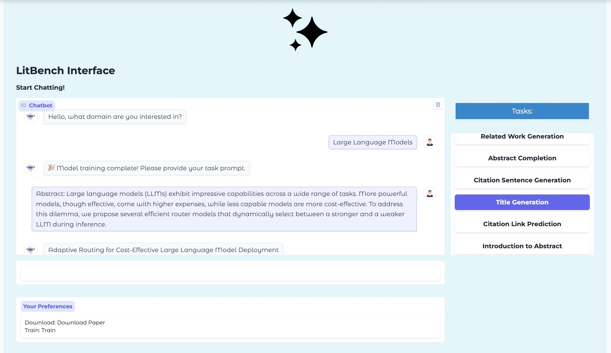

# LitBench: A Large Language Model Benchmarking Framework For Literature Tasks

## Overview

LitBench is a benchmarking framework designed to **develop and evaluate domain-specific Large Language Models (LLMs)** tailored to literature-related tasks. While LLMs have become the **de facto tool** for such tasks, they still struggle to adapt to **domain-specific contexts, terminologies, and nomenclatures**—especially in tasks like related work generation, where nuanced domain knowledge is crucial. LitBench addresses this challenge by **curating domain-specific literature datasets** and enabling rigorous **benchmarking across literature-based tasks**.

At its core, LitBench employs a **data curation process** that generates **domain-specific literature sub-graphs** and constructs training datasets using the textual attributes of the resulting nodes and edges. These datasets **help LLMs internalize domain knowledge and relationships embedded in the curated graphs**, enhancing their ability to reason over specialized academic literature. 

LitBench is designed with **flexibility** in mind, supporting the curation of **both broad high-level domains and specialized interdisciplinary niches**. In addition to dataset creation, LitBench defines a **comprehensive suite of literature tasks**—ranging from **node- and edge-level analyses** to **advanced applications like related work generation**—to rigorously evaluate model performance.

Our results demonstrate that **small, domain-specific LLMs trained on LitBench datasets achieve competitive performance** compared to state-of-the-art models like **GPT-4 and DeepSeek-R1** on literature-related tasks. To enhance accessibility and usability, we open-source the framework alongside an **AI agent tool** that streamlines **data curation, model training, and evaluation**.


## Key Features:

- **Domain-Specific Adaptation**: Constructs **literature sub-graphs** and **training datasets** by extracting textual attributes from academic literature.
  
- **Comprehensive Benchmarking**: Defines a **suite of literature tasks**, from **node- and edge-level analyses** to **advanced applications like related work generation**.
  
- **Competitive Performance**: Demonstrates that **small, domain-specific LLMs trained on LitBench datasets** achieve results comparable to state-of-the-art models such as **GPT-4 and DeepSeek-R1**.
  
- **Flexible and Scalable**: Supports literature graph curation across **both broad domains and specialized research areas**.
  
- **Open-Source and Accessible**: Includes an **AI agent tool** to streamline **data curation, model training, and evaluation**.

## Installation

### Prerequisites

Ensure you have Python 3.10 installed before proceeding with the setup.

### Setup Steps

```bash
# Clone the repository
git clone <repository_url>
cd litbench

# Create a virtual environment
python3.10 -m venv litbench

# Activate the virtual environment
source litbench/bin/activate  # On macOS/Linux
litbench\Scripts\activate  # On Windows

# Install dependencies
pip install -r requirements.txt

# Token setup for Hugging Face
huggingface-cli login
```

### Downloading topics refined dataset [`AliMaatouk/arXiv_Topics`](https://huggingface.co/datasets/AliMaatouk/arXiv_Topics) from Hugging Face, which provides a structured mapping of arXiv papers to hierarchical topic categories.

```bash
# Download the topics refined dataset
cd litbench/datasets/
wget https://huggingface.co/datasets/AliMaatouk/arXiv_Topics/resolve/main/arxiv_topics.json
```

## Usage

Running the Citation Graph Module

```bash
cd litbench
source litbench/bin/activate  # Activate virtual environment
python3.10 src/litbench_pipeline.py
```

## Navigating the LitBench UI

The LitBench user interface consists of two main stages: **preferences selection** and **the interactive chatbot interface**.

### **1. Setting Preferences**
Upon launching the interface, users are first directed to the preferences page, where they must specify:
- Whether to **download** new papers and construct a dataset from scratch.
- Whether to **train the model** on the retrieved/predetermined dataset or use a pre-trained model from the config file.

Once preferences are set, users are directed to the chatbot interface.

### **2. Chatbot Interface**
After setting preferences:
- If **training is selected**, users will first be prompted to specify their domain of interest before proceeding.
- If **no training is selected**, users will be immediately prompted to provide their task prompt.

Once relevant papers are retrieved, downloaded, and cleaned (if `download=True`), and the model is fine-tuned (if training is enabled), users will be prompted to **enter their task prompt**.

### **3. Selecting a Task (Optional)**
The UI provides a **dropdown menu** with eight predefined literature tasks. If your task corresponds to one of these, please select it from the dropdown. Each task has a **specific input format**, which you can find in the docs/tasks/ directory.

To format your input correctly, refer to the corresponding `.md` file for each task:
- **Citation Sentence Generation** → [`citation_sentence.md`](docs/tasks/citation_sentence.md)
- **Citation Link Prediction** → [`link_pred.md`](docs/tasks/link_pred.md)
- **Abstract Completion** → [`abs_completion.md`](docs/tasks/abs_completion.md)
- **Title Generation** → [`abs_2_title.md`](docs/tasks/abs_2_title.md)
- **Citation Recommendation** → [`paper_retrieval.md`](docs/tasks/paper_retrieval.md)
- **Introduction to Abstract** → [`intro_2_abs.md`](docs/tasks/intro_2_abs.md)
- **Influential Papers Recommendation** → [`influential_papers.md`](docs/tasks/influential_papers.md)

If no task is selected, the model will run a **general inference process**, responding freely based on the user's prompt.
